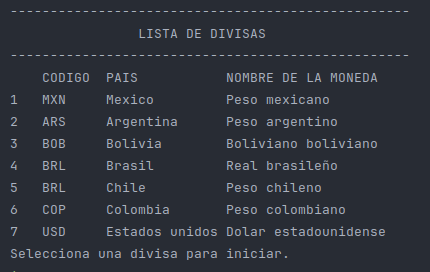

# Conversor de monedas.

Practicando con Java: Challenge Conversor de Monedas.

## Sobre el challenge.

_Realiza solicitudes a una API de tasas de cambio, manipula datos JSON, filtra y muestra las monedas de interés._

### Pre-requisitos 

* _Importar la biblioteca [Gson](https://central.sonatype.com/artifact/com.google.code.gson/gson?smo=true) en el entorno de desarrollo_

* _Generar una KEY en [ExchangeRate-API](https://www.exchangerate-api.com/)_

### Galeria 
_Mensaje de bienvenida y menu principal._

_Lista de las divisas soportadas por el sistema de conversion._

## Construido con 🛠️
* [Java JDK](https://www.oracle.com/br/java/technologies/downloads/) - Java JDK: versión 17

## Autores ✒️
Diego Huaroc
